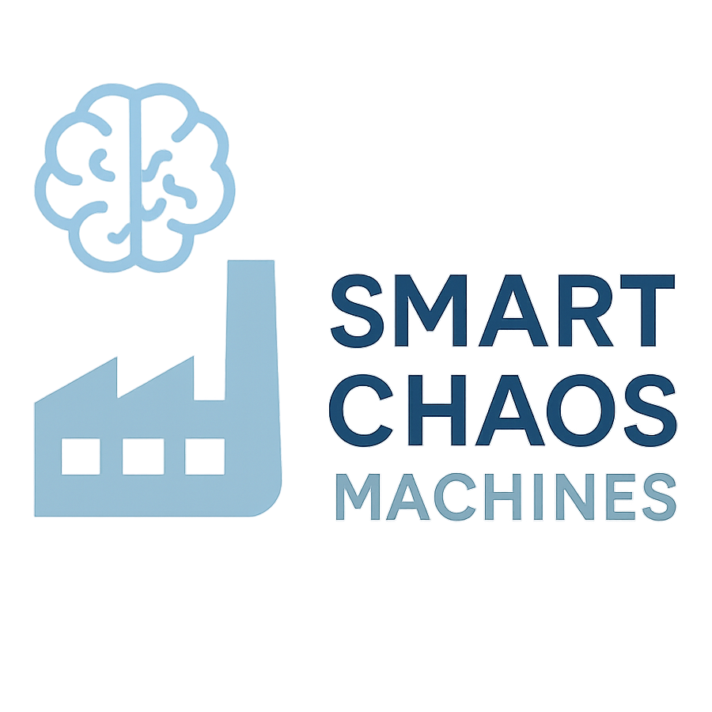

  

# **Smart Chaos Machines: Solution Overview**

**Smart Chaos Machines** is an intelligent counting machine optimization platform designed to revolutionize factory packing operations. Currently, factory operators manually configure counting machines for each production order based on brick type and production requirements. It is a time-intensive process that relies heavily on operator experience and intuition.

The solution automates this configuration process by collecting real-time performance data from counting machines via OPC-UA protocol, analyzing historical patterns, and applying machine learning algorithms to determine optimal settings. The system will automatically configure counting machines during production changeovers, reducing manual intervention while improving throughput and consistency.

**Key capabilities include:**
- Real-time monitoring and control of counting machines across production lines
- Automated configuration management based on production orders and element characteristics  
- Comprehensive observability dashboards for operators, developers, and data scientists
- Machine learning-driven optimization that continuously improves based on performance feedback
- Global deployment architecture supporting factories worldwide

The platform transforms counting machine operations from reactive, manual processes to proactive, data-driven automation—ultimately reducing changeover times, minimizing human error, and establishing a foundation for continuous performance optimization across the global manufacturing network.

### 📄 **[See full Project Proposal here](Documentation/Project%20Proposal.md)**

## Architecture Diagram ##

**Diagram Reference:** This system diagram is also created using the <a href="https://c4model.com/" target="_blank">C4 model</a> for visualizing software architecture.

**Diagram Reference:** This architecture diagram is created using the <a href="https://c4model.com/" target="_blank">C4 model</a> for visualizing software architecture.

---

# **How We Work:** 

> The team operates in 2-week agile sprints. For details on our collaboration, pairing, and planning practices, see [Team Ways of Working](#team-ways-of-working).

# **Project Structure**

> **Tech Stack:** This project is built with **.NET 10** and follows the principles of **CLEAN architecture** for maintainability, scalability, and testability.

## Troubleshooting

### Browser Certificate Error

https://learn.microsoft.com/en-us/dotnet/aspire/troubleshooting/untrusted-localhost-certificate

1. Close all browser windows
2. Run `dotnet dev-certs https --clean`
3. Run `dotnet dev-certs https --trust`
4. Rebuild solution and run